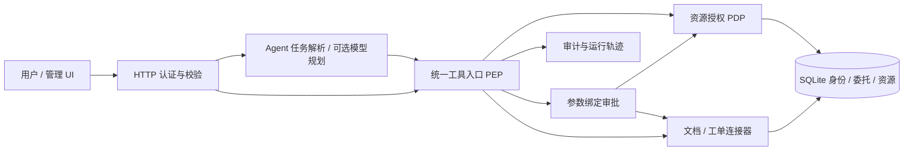
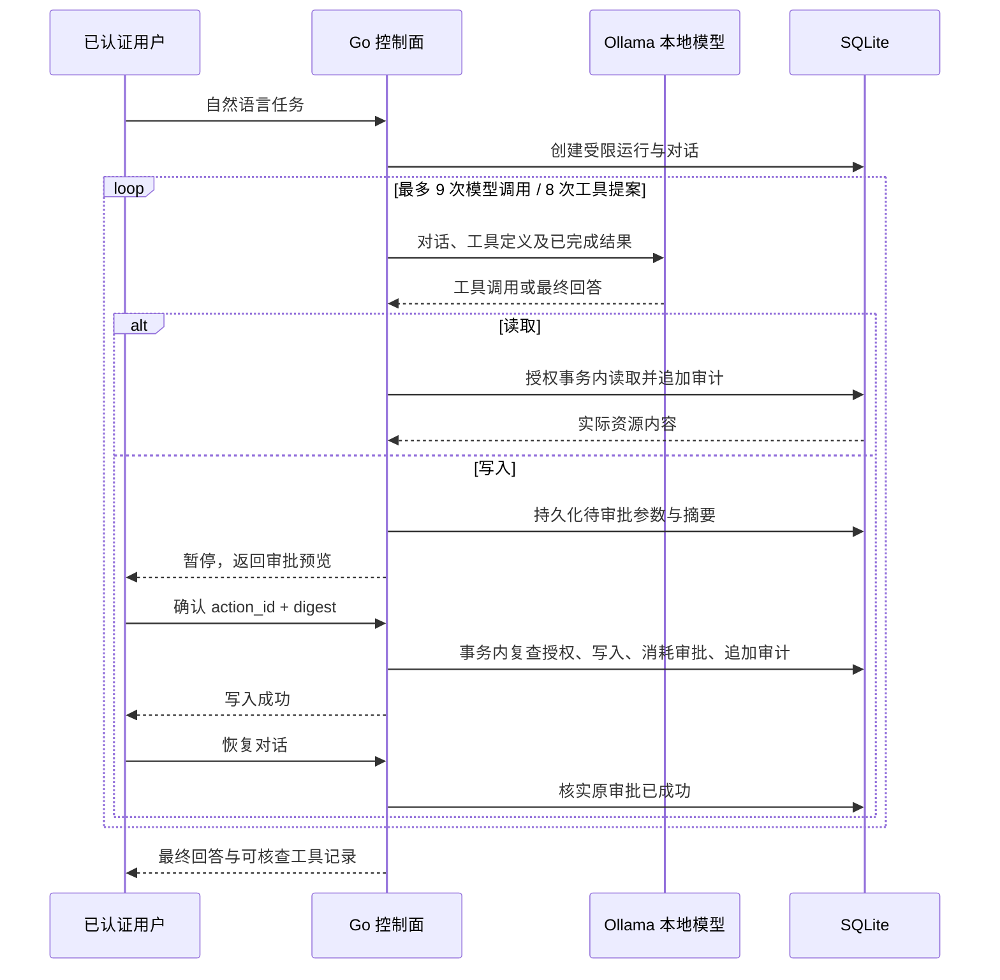

# 架构与决策

AgentGate 是模块化 Go 单体，不是微服务集合。浏览器与模型均不持有数据库访问权。只有内置受信任代码能访问 Store；不支持装载不可信插件。当前 SQLite 单连接、进程锁约束为单实例运行。

上述为本地多步流程。固定命令与远端兼容接口是单步入口；它们不执行该模型结果循环。写入成功与最终自然语言回答是两个阶段，后者失败不会回滚已经提交的工单更新。

## 模块责任

- `auth.go`：已验证 subject 映射到 DB identity；不信任请求 tenant_id。
- `policy.go`：默认拒绝，检查角色、动作、Agent、资源所有者、租户、运行期限/步骤。`Evaluate` 为纯计算部分，`authorize` 在事务中加载真实属性。
- `engine.go`：唯一公开业务入口，控制审批与副作用的原子状态变更。
- `connectors.go`：两种资源类型的连接器契约。当前均使用真实 SQLite，未模拟第三方 SaaS。
- `chat.go` / `ollama.go`：本地自然语言 → 工具提案 → 逐次授权 → 工具结果回传模型；写入暂停等待审批，恢复后继续生成回答。对话同租户同用户隔离。
- `model.go`：可选外部规划器无 DB、用户凭证或审批接口；模型仅选择一个工具，不循环解析工具结果。
- `http.go`：schema 等效的严格 Go 字段校验、请求大小、认证、有界并发、分页、错误映射与 HTTP request ID。

## 为什么事务，而不是分布式 exactly-once

本地资源与审批在同一 DB。串行事务同时解决确认重放、权限变更竞态和写入原子性。HTTP 响应丢失时，通过审批状态查询确认结果，不通过盲目重放确认推断失败。远端副作用不在此事务中，当前未接入远端业务写入。

## 未实现的能力

无模型训练/微调、向量 RAG、MCP、消息队列、Kubernetes、多 Agent 或任意代码执行。工程扩展应先解决真实场景，再引入独立 worker/outbox。
